# Pickaroo Crave Match v2 — Technical Documentation

> **Document Version:** 2.0  
> **Date:** April 6, 2026  
> **Author:** Pickaroo Engineering  
> **Status:** Prototype — Browser-based static demo

---

## Table of Contents

1. [Executive Summary](#1-executive-summary)
2. [System Overview](#2-system-overview)
3. [Capabilities Matrix](#3-capabilities-matrix)
4. [System Diagrams](#4-system-diagrams)
   - 4.1 [Context Diagram](#41-context-diagram)
   - 4.2 [Data Flow Diagram (DFD) — Level 0](#42-data-flow-diagram-dfd--level-0)
   - 4.3 [Data Flow Diagram (DFD) — Level 1](#43-data-flow-diagram-dfd--level-1)
   - 4.4 [System Flow Diagram (SFD)](#44-system-flow-diagram-sfd)
   - 4.5 [HIPO Chart](#45-hipo-chart-hierarchy-plus-inputprocessoutput)
5. [Screen-by-Screen Specification](#5-screen-by-screen-specification)
6. [Data Dictionary](#6-data-dictionary)
7. [Business Rules Engine](#7-business-rules-engine)
8. [Technical Architecture](#8-technical-architecture)
9. [Non-Functional Requirements](#9-non-functional-requirements)
10. [Risks & Mitigations](#10-risks--mitigations)

---

## 1. Executive Summary

**Pickaroo Crave Match** is a gamified group food ordering module that solves the "what should we eat?" problem for friend groups, families, and office teams. It uses a Tinder-like swipe mechanic to aggregate food preferences across a group, determines a consensus match, and routes all orders through a **Unified Hub Delivery** system — one rider, one fee, multiple restaurants.

### Value Proposition

| Stakeholder | Value |
|---|---|
| **End Users** | Removes decision paralysis; fun social experience; cheaper delivery via shared fees |
| **Pickaroo** | Higher AOV (average order value) via group orders; viral acquisition through invite links; increased engagement through gamification |
| **Restaurant Partners** | Access to group orders they wouldn't normally receive; Ally Drop expands their delivery radius |

### Key Metrics (Target)

| Metric | Target |
|---|---|
| Time to first swipe | < 5 seconds |
| Swipe completion rate | > 80% |
| Group conversion (match → order) | > 60% |
| Average group size | 3–5 hunters |
| Average order value | ₱800+ |

---

## 2. System Overview

Crave Match operates as a **3-screen progressive flow** within the Pickaroo mobile app:

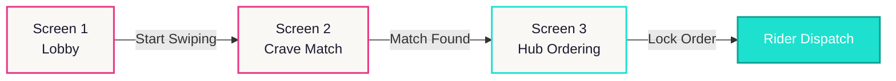

### Technology Stack (Prototype)

| Layer | Technology |
|---|---|
| Structure | HTML5 (Semantic) |
| Styling | Vanilla CSS3 (Custom properties, CSS animations) |
| Logic | Vanilla JavaScript (ES6+, Pointer Events API, Canvas API) |
| Modals/Toasts | SweetAlert2 |
| Icons | Font Awesome 6 |
| Typography | Google Fonts (Inter, Outfit) |
| Assets | AI-generated food photography (PNG) |

---

## 3. Capabilities Matrix

### 3.1 Screen 1 — Lobby

| Capability | Description | Status |
|---|---|---|
| **Live Activity Feed** | Auto-scrolling ticker displaying real-time group events (joins, swipe activity, countdowns). Updates every 4 seconds. | ✅ Implemented |
| **Invite / Share** | One-tap invite link copy. Simulates friend joining with avatar pop-in animation. | ✅ Implemented |
| **Stacking Discount Display** | Two-way discount model visualized via tier pills: 5 friends = 5% off, ₱500+ basket = 5% off, max 10%. | ✅ Implemented |
| **Hunters Strip** | Overlapping avatar row showing current group members. Max 12. | ✅ Implemented |
| **Lobby Lock & Navigate** | CTA button locks lobby and transitions to swipe screen with loading state animation. | ✅ Implemented |
| **Leave Match Confirmation** | Modal confirmation to prevent accidental exits. | ✅ Implemented |

### 3.2 Screen 2 — Crave Match (Swipe)

| Capability | Description | Status |
|---|---|---|
| **Photo-First Swipe Cards** | Full-bleed food photography with gradient overlay, category badge, title, and subtitle. | ✅ Implemented |
| **Drag Gesture Swiping** | Pointer Events API-based drag with rotation physics, opacity fade, and snap-back on insufficient threshold (80px). | ✅ Implemented |
| **CRAVE / NOPE Stamps** | Overlaid text stamps that appear during drag (40px threshold), with scale+rotation animations. | ✅ Implemented |
| **Button Swiping** | Alternative NOPE (❌) and CRAVE (🔥) buttons for users who prefer tapping. Includes shake and pulse micro-animations. | ✅ Implemented |
| **3-Deck System** | 24 food categories across 3 interchangeable decks (8 cards each). | ✅ Implemented |
| **Refresh Deck** | Shuffle button cycles to the next deck with spin animation and card scale-out transition. Resets progress. | ✅ Implemented |
| **Progress Dots** | Color-coded indicators: cerise = craved, gray = noped, pill shape = current card. | ✅ Implemented |
| **Dynamic Match Result** | Determines top match and runner-up based on actual swipe choices (not hardcoded). | ✅ Implemented |
| **Confetti Celebration** | Canvas-based 60-particle confetti burst on match found, with gravity, rotation, and fade physics. | ✅ Implemented |
| **Mini Activity Ticker** | Shows simulated group activity ("Raff craved Smash Burgers") updating every 5 seconds. | ✅ Implemented |
| **Swipers Badge** | Shows "3/5 Swiping" status with green pulse dot. | ✅ Implemented |

### 3.3 Screen 3 — Hub Ordering

| Capability | Description | Status |
|---|---|---|
| **Match Summary Badge** | Displays group consensus result with vote count. | ✅ Implemented |
| **Restaurant Picker** | 2-step modal: pick restaurant → pick menu item. 4 restaurants × 3 items each. | ✅ Implemented |
| **Personal Cart** | Dynamic cart that accepts items from the picker. Empty state prompt converts to item list. | ✅ Implemented |
| **Group Items View** | Read-only view of other members' orders with avatar, restaurant, and per-item breakdown. | ✅ Implemented |
| **Ally Drop** | Enhanced nearby restaurant integration showing: distance (300m), savings comparison ("Saves ₱45 vs separate order"). | ✅ Implemented |
| **Payment Split — Even** | Total ÷ member count. Auto-recalculates on cart changes. | ✅ Implemented |
| **Payment Split — By Item** | Each person pays own items + proportional delivery fee share. | ✅ Implemented |
| **Payment Split — Custom** | Manual editing mode. | 🔲 Placeholder |
| **Payment Methods** | Horizontal picker: GCash, Maya, Card, COD, QR Ph. Visual selection state. | ✅ Implemented |
| **Stack Discount Engine** | Auto-applies 5% discount when basket ≥ ₱500. Displayed as line item in totals. | ✅ Implemented |
| **Checkout Flow** | Loading state → confirmation modal with payment method, your share, Ally Drop summary, and ETA. | ✅ Implemented |
| **Live Feed** | Same auto-scrolling ticker as lobby, contextualized for ordering ("Raff confirmed payment via GCash"). | ✅ Implemented |

---

## 4. System Diagrams

### 4.1 Context Diagram

The Context Diagram shows Crave Match as a single process interacting with all external entities.

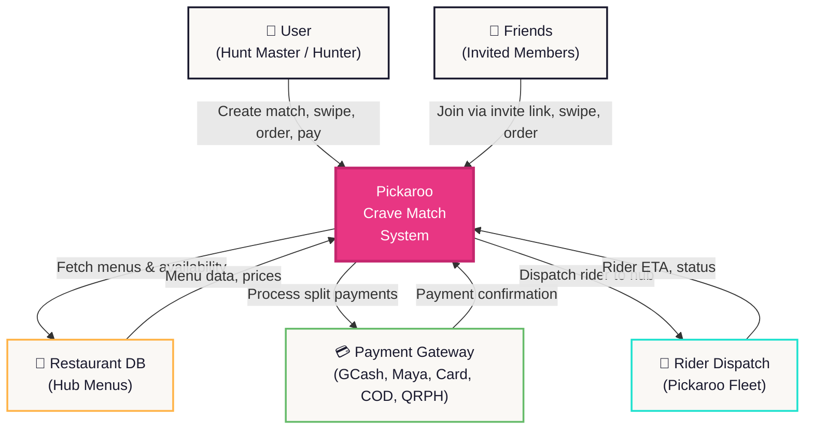

**External Entities:**

| Entity | Role | Data Exchanged |
|---|---|---|
| **User (Hunt Master)** | Creates session, invites friends, locks lobby, swipes, orders, pays, receives delivery | Session config, swipe decisions, cart items, payment |
| **Friends (Hunters)** | Join via invite link, swipe, add items, pay their share | Join events, swipe decisions, cart items, payment |
| **Restaurant Database** | Serves menu data for the hub picker | Menu items, prices, availability, restaurant metadata |
| **Payment Gateway** | Processes split payments per member | Payment requests, confirmations, pre-auth holds |
| **Rider Dispatch** | Assigns and tracks rider for the unified hub delivery | Pickup locations, drop-off address, ETA updates |

---

### 4.2 Data Flow Diagram (DFD) — Level 0

The Level 0 DFD shows the single Crave Match process with all data stores and external flows.

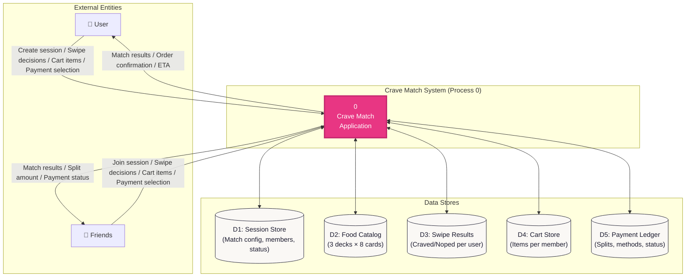

---

### 4.3 Data Flow Diagram (DFD) — Level 1

The Level 1 DFD decomposes Process 0 into its 5 core sub-processes.

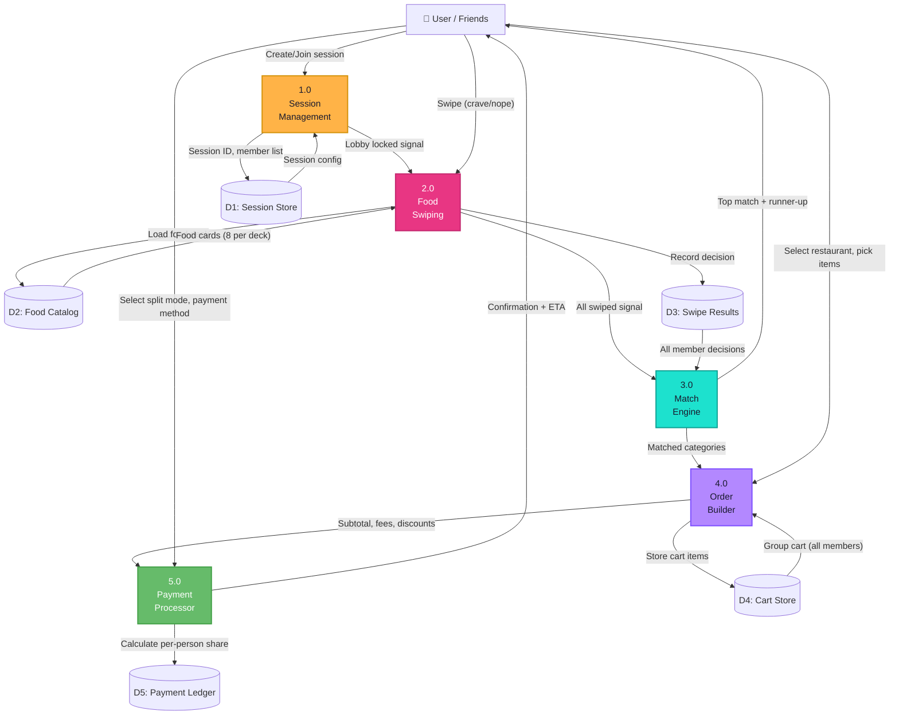

**Process Descriptions:**

| Process | Name | Inputs | Outputs | Logic |
|---|---|---|---|---|
| **1.0** | Session Management | Create/join request, invite link | Session ID, member list, activity feed events | Creates match session, manages members (max 20), generates invite links (2hr expiry), broadcasts join/leave events |
| **2.0** | Food Swiping | Food deck data, user swipe gesture | Craved/noped arrays, progress state | Renders photo cards, captures drag gestures (80px threshold), tracks decisions per card, supports deck refresh |
| **3.0** | Match Engine | All member swipe results | Top match, runner-up, vote counts | Aggregates craved lists across members, determines consensus via vote count, resolves ties |
| **4.0** | Order Builder | Restaurant menus, user selections | Cart items, subtotal, fees | Presents hub restaurants, adds items to personal cart, aggregates group cart, calculates subtotal + delivery fees |
| **5.0** | Payment Processor | Split mode, payment method, totals | Per-person share, confirmation | Computes split (even/by-item/custom), applies stack discount, processes payment, generates confirmation |

---

### 4.4 System Flow Diagram (SFD)

The SFD shows the complete user journey from start to finish, including decision points and error handling.

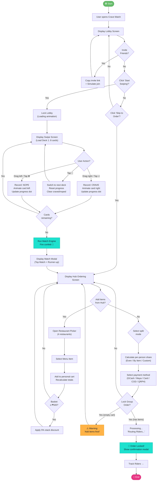

---

### 4.5 HIPO Chart (Hierarchy Plus Input/Process/Output)

#### 4.5.1 Module Hierarchy

```mermaid
graph TD
    ROOT["Crave Match System\n(Root Module)"]
    
    ROOT --> M1["1.0 Lobby Module\n(script.js)"]
    ROOT --> M2["2.0 Swipe Module\n(crave_match.js)"]
    ROOT --> M3["3.0 Order Module\n(shared_order.js)"]
    
    M1 --> M1A["1.1 Live Activity Feed"]
    M1 --> M1B["1.2 Invite / Share"]
    M1 --> M1C["1.3 Discount Tier Display"]
    M1 --> M1D["1.4 Lobby Lock / Navigate"]
    
    M2 --> M2A["2.1 Card Renderer"]
    M2 --> M2B["2.2 Drag Gesture Engine"]
    M2 --> M2C["2.3 Swipe Tracker"]
    M2 --> M2D["2.4 Deck Refresh"]
    M2 --> M2E["2.5 Match Engine"]
    M2 --> M2F["2.6 Confetti Renderer"]
    
    M3 --> M3A["3.1 Restaurant Picker"]
    M3 --> M3B["3.2 Cart Manager"]
    M3 --> M3C["3.3 Split Calculator"]
    M3 --> M3D["3.4 Payment Selector"]
    M3 --> M3E["3.5 Checkout Processor"]

    style ROOT fill:#E83683,stroke:#c4276e,color:#fff,stroke-width:2px
    style M1 fill:#FFB347,stroke:#D4920A,color:#1A1A2E,stroke-width:2px
    style M2 fill:#1DE1CE,stroke:#0fa294,color:#1A1A2E,stroke-width:2px
    style M3 fill:#B388FF,stroke:#7C4DFF,color:#1A1A2E,stroke-width:2px
```

#### 4.5.2 IPO Detail — Per Module

> [!NOTE]
> Each row below maps a sub-module to its exact Input, Processing logic, and Output as implemented in the current codebase.

---

**Module 1.0 — Lobby (script.js)**

| Sub-Module | Input | Process | Output |
|---|---|---|---|
| **1.1 Live Activity Feed** | `activityMessages[]` array (6 pre-defined messages) | `setInterval(addActivityItem, 4000)` — creates DOM element, inserts before first child, trims to max 3 visible items | Animated `activity-item` DOM nodes with emoji, text, timestamp |
| **1.2 Invite / Share** | Click event on `#share-btn` | 1. Show toast "Invite link copied!" 2. Swap button icon to ✓ 3. After 1.5s: create avatar element with random pastel color, append to `#avatar-row` with scale(0→1) bounce animation 4. Increment `huntersCount` 5. Add "X joined" to activity feed | New avatar in strip, activity feed entry, timer on invite feedback |
| **1.3 Discount Tier Display** | `huntersCount` integer | `updateDiscountTiers()` — if hunters ≥ 5, activates first `.tier-pill` via `.active` class | Visual state change on tier pill (turquoise highlight) |
| **1.4 Lobby Lock** | Click event on `#start-swiping-btn` | 1. Remove `.pulse` class 2. Set text to "Locking Lobby..." with reduced opacity 3. After 800ms: set text to "Let's Go! 🚀" 4. After 600ms more: `window.location.href = 'crave_match.html'` | Page navigation to swipe screen |

---

**Module 2.0 — Swipe (crave_match.js)**

| Sub-Module | Input | Process | Output |
|---|---|---|---|
| **2.1 Card Renderer** | `foodCards[]` (current deck, 8 items), `currentIndex` | `renderCards()` — clears container, iterates remaining cards in reverse, calculates scale (1 − stackPos×0.04) and translateY (stackPos×−12) per card, hides cards beyond position 3 with opacity:0. Attaches drag to top card. | Stack of `swipe-card` DOM elements with photo, overlay, stamps, content |
| **2.2 Drag Gesture Engine** | `pointerdown`, `pointermove`, `pointerup` events | `onPointerDown`: capture pointer, record startX. `onPointerMove`: calc deltaX, apply `translateX(Δx) rotate(Δx×0.08)`, show CRAVE stamp if Δx > 40, NOPE stamp if Δx < −40. `onPointerUp`: if \|Δx\| > 80px threshold fire swipe, else snap back. | Card visual follows finger; stamps appear; swipe triggers or snap-back |
| **2.3 Swipe Tracker** | `direction` ('left'/'right'), `currentFood` object | `swipeTopCard()` — pushes to `craved[]` or `noped[]`, applies `card-swipe-left/right` CSS class, increments `currentIndex`, calls `renderProgressDots()`, after 350ms removes card DOM and calls `updateRemainingCards()` | Updated arrays, animated card exit, progress dot state change |
| **2.4 Deck Refresh** | Click event on `#btn-refresh` | `btnRefresh.click` — cycles `currentDeckIndex` (mod 3), replaces `foodCards`, resets `currentIndex`/`craved`/`noped`, animates existing cards to scale(0.5)+opacity(0), after 350ms re-renders | New deck loaded, progress reset, spin animation on button |
| **2.5 Match Engine** | `craved[]` array after all 8 cards swiped | `showMatchResult()` — `craved[0]` = top match, `craved[1]` = runner-up, uses `craved.length` for vote count. Shows "All Swiped!" empty state, then SweetAlert modal after 1200ms with match results and "Order from Hub" CTA. | Confetti burst, empty state card, modal with match data, navigation to order screen |
| **2.6 Confetti Renderer** | Canvas element `#confetti-canvas` | `fireConfetti()` — creates 60 particles at canvas center, each with random velocity/color/rotation/size. Runs `requestAnimationFrame` loop applying gravity (+0.15 vy), air resistance (×0.98 vx), fade (−0.012 opacity), and rotation. Terminates at frame 120 or all particles faded. | 60 animated confetti rectangles on canvas overlay |

---

**Module 3.0 — Order (shared_order.js)**

| Sub-Module | Input | Process | Output |
|---|---|---|---|
| **3.1 Restaurant Picker** | Click event on `#add-more-btn`, `restaurants[]` array (4 restaurants × 3 items) | Step 1: SweetAlert modal lists restaurants with icon/name/item count. Step 2: On restaurant click, opens second modal listing menu items with prices. On item click, calls `addItemToCart()`. | 2-step modal flow → item added to cart |
| **3.2 Cart Manager** | `item` object, `restaurant` object from picker | `addItemToCart()` — clears empty state on first add, pushes `{name, price, restaurant}` to `cartItems[]`, adds `mySubtotal`, creates order-item DOM element, calls `recalculateTotals()`, shows toast confirmation. | Cart item in DOM, updated subtotal, toast notification |
| **3.3 Split Calculator** | `splitMode` ('even'/'item'/'custom'), `total` number | `updateSplitAmounts()` — **Even**: total ÷ 4 for all members. **By Item**: each member's own items + (hubDeliveryFee + allyDropFee) ÷ 4. **Custom**: no-op (placeholder). Updates all `.split-amount` elements. | Per-person share amounts displayed in split rows |
| **3.4 Payment Selector** | Click event on `.method-card` elements | Event delegation on `#payment-methods` — removes `.selected` from all, adds to clicked card, updates `selectedPayment` variable, applies scale(0.93) micro-animation. | Visual selection state, stored payment method string |
| **3.5 Checkout Processor** | Click on `#lock-order-btn`, `cartItems[]`, `selectedPayment`, `yourShareEl.textContent` | 1. Guard: if cart empty, show warning modal. 2. Set button to "Routing Riders..." with opacity 0.7. 3. After 1500ms: set to "Order Locked! 🚀", change bg to cerise. 4. Show SweetAlert with payment method, your share, Ally Drop info, and ETA (25-35 min). 5. After 3000ms: reset button. | Loading state, confirmation modal, button state cycle |

---

## 5. Screen-by-Screen Specification

### 5.1 Screen 1 — Lobby

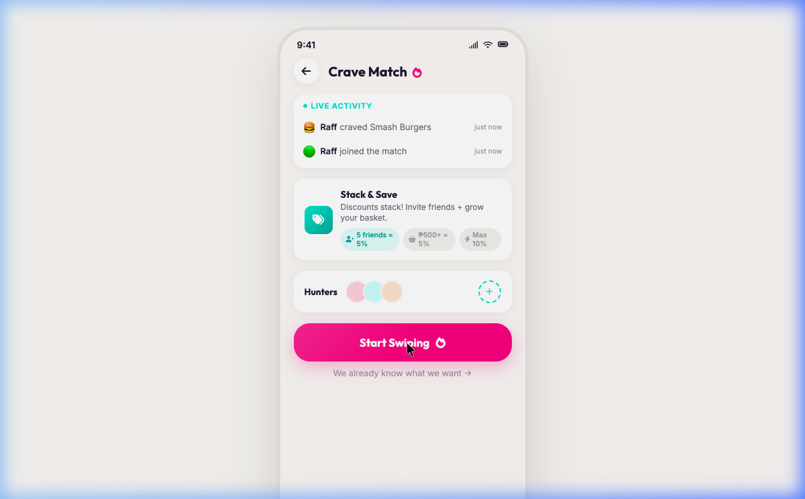

| Element | Component | Behavior |
|---|---|---|
| **Status Bar** | Time + signal/wifi/battery icons | Static display |
| **Header** | Back button + "Crave Match 🔥" title | Back → leave confirmation modal |
| **Live Activity Feed** | 3-item ticker with pulse dot | Auto-updates every 4s; new items slide in from top |
| **Stack & Save Badge** | Icon + title + description + 3 tier pills | First pill active by default; second activates at ₱500+ basket |
| **Hunters Strip** | "Hunters" label + avatar row + ➕ button | Avatars overlap (−8px margin); ➕ triggers invite flow |
| **CTA Button** | "Start Swiping 🔥" in cerise | Pulse shadow animation; locks on click with loading states |
| **Skip Link** | "We already know what we want →" | Direct navigation to `shared_order.html` |
| **Footer** | Home indicator bar | Glassmorphic background blur |

### 5.2 Screen 2 — Crave Match

````carousel
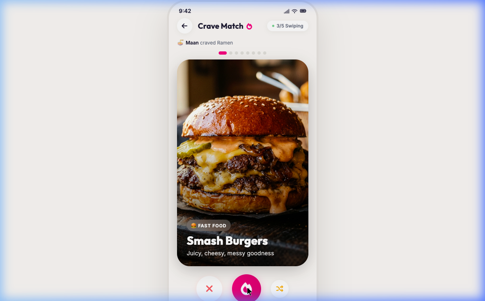
<!-- slide -->
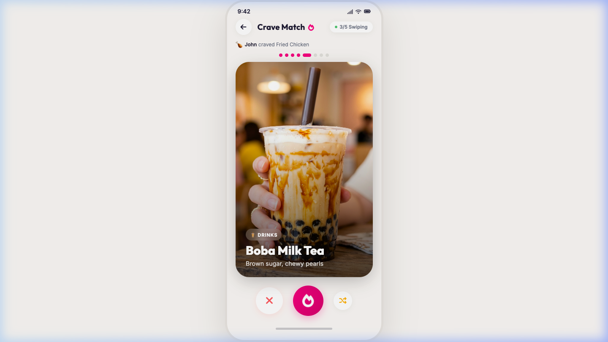
<!-- slide -->
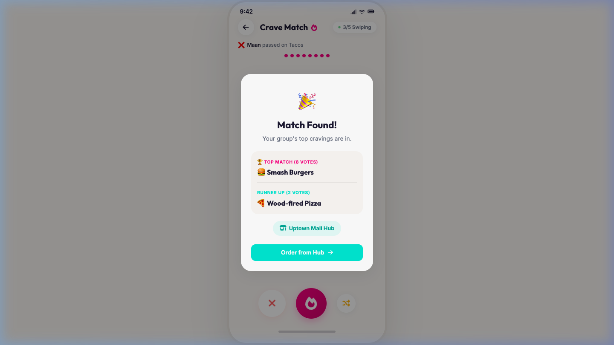
````

| Element | Component | Behavior |
|---|---|---|
| **Header** | Back + title + "3/5 Swiping" badge | Badge shows active swiper count with pulse dot |
| **Mini Activity** | Single-line ticker | Updates on each swipe + auto-simulated every 5s |
| **Progress Dots** | 8 dots (1 per card) | Active = cerise pill, Done = turquoise/cerise/gray circle |
| **Card Stack** | Max 3 visible, 8 in DOM | Top card: scale(1). 2nd: scale(0.96) translateY(−12px). 3rd: scale(0.92) translateY(−24px). Rest: hidden |
| **CRAVE Stamp** | "CRAVE" text, turquoise border | Appears at 40px rightward drag with bounce scale |
| **NOPE Stamp** | "NOPE" text, red border | Appears at 40px leftward drag with bounce scale |
| **NOPE Button** | White circle, red ❌ | Shake animation on hover; triggers left swipe |
| **CRAVE Button** | Cerise gradient circle, white 🔥 | Flame dance animation; scale pulse on click |
| **Refresh Button** | White circle, honey 🔀 | Spin animation; cycles deck (1→2→3→1) |

### 5.3 Screen 3 — Hub Ordering

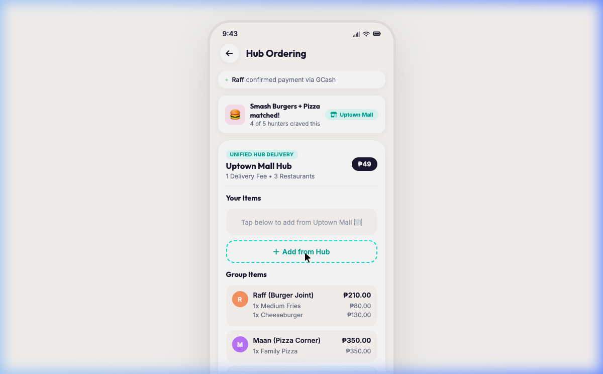

| Element | Component | Behavior |
|---|---|---|
| **Mini Feed** | Single-line with green pulse dot | Updates every 5s + on user cart changes |
| **Match Badge** | Burger icon + match text + hub pill | Read-only summary from match result |
| **Hub Header** | "Unified Hub Delivery" badge + name + fee | Shows restaurant count and flat ₱49 delivery fee |
| **Your Items** | Empty state → cart items | "Tap below to add from Uptown Mall 🍽️" converts to item list |
| **Add from Hub** | Dashed turquoise button | Opens 2-step restaurant→menu picker modal |
| **Group Items** | Per-member order cards | Avatar + name + restaurant + itemized prices |
| **Ally Drop Card** | Turquoise-bordered order card | Shows "300m away" tag + "Saves ₱45 vs separate order" |
| **Split Payment** | Segmented control + member rows | Even/By Item/Custom toggle; per-person avatar + amount + status badge |
| **Payment Methods** | Horizontal scroll of 5 cards | GCash, Maya, Card, COD, QR Ph; selected = cerise border |
| **Totals** | Subtotal + delivery + Ally Drop + discount + total | Stack discount auto-shows at ₱500+; total in cerise Outfit font |
| **Lock Order CTA** | Turquoise full-width button | Guards empty cart; shows loading + confirmation modal |

---

## 6. Data Dictionary

### 6.1 Food Card Object

```json
{
  "id": 1,
  "name": "Smash Burgers",
  "subtitle": "Juicy, cheesy, messy goodness",
  "icon": "🍔",
  "image": "images/smash_burger.png",
  "category": "Fast Food"
}
```

| Field | Type | Description |
|---|---|---|
| `id` | `number` | Unique identifier (1–24 across 3 decks) |
| `name` | `string` | Display name for the card title |
| `subtitle` | `string` | Appetizing description below title |
| `icon` | `string` | Emoji icon for category badge and activity feed |
| `image` | `string` | Relative path to food photo (PNG) |
| `category` | `string` | Cuisine category label |

### 6.2 Restaurant Object

```json
{
  "name": "Burger Joint",
  "icon": "🍔",
  "items": [
    { "name": "Smash Burger", "price": 180 },
    { "name": "Cheesy Fries", "price": 95 },
    { "name": "Milkshake", "price": 120 }
  ]
}
```

### 6.3 Cart Item Object

```json
{
  "name": "Smash Burger",
  "price": 180,
  "restaurant": "Burger Joint"
}
```

### 6.4 Session State Variables

| Variable | Type | Scope | Description |
|---|---|---|---|
| `huntersCount` | `number` | Lobby | Current member count (init: 3, max: 12) |
| `currentDeckIndex` | `number` | Swipe | Active deck (0, 1, or 2) |
| `foodCards` | `array` | Swipe | Current deck's 8 food items |
| `currentIndex` | `number` | Swipe | Index of top card (0–7) |
| `craved` | `array` | Swipe | Food items swiped right |
| `noped` | `array` | Swipe | Food items swiped left |
| `cartItems` | `array` | Order | User's personal cart items |
| `mySubtotal` | `number` | Order | Sum of user's cart items (₱) |
| `groupItemsTotal` | `number` | Order | Sum of group members' items (₱780 fixed in prototype) |
| `selectedPayment` | `string` | Order | Active payment method key |
| `splitMode` | `string` | Order | Active split mode ('even', 'item', 'custom') |

---

## 7. Business Rules Engine

### 7.1 Stacking Discount Logic

```
RULE: Stack Discount Calculation

IF group_size >= 5 THEN
    friend_discount = 5%
ELSE
    friend_discount = 0%

IF basket_subtotal >= 500 THEN
    basket_discount = 5%
ELSE
    basket_discount = 0%

total_discount = MIN(friend_discount + basket_discount, 10%)
discount_amount = ROUND(basket_subtotal × total_discount)
```

> [!IMPORTANT]
> The maximum combined discount is capped at **10%** to protect margins. Both conditions can stack independently.

### 7.2 Split Payment Logic

```
RULE: Even Split
    per_person = total / member_count

RULE: By Item Split
    fee_share = (hub_delivery_fee + ally_drop_fee) / member_count
    per_person = own_items_subtotal + fee_share

RULE: Custom Split (Future)
    per_person = manually_entered_amount
    CONSTRAINT: SUM(all_shares) MUST EQUAL total
```

### 7.3 Ally Drop Eligibility

```
RULE: Ally Drop
    IF restaurant_distance <= 500m FROM hub THEN
        eligible = TRUE
        ally_fee = ₱15 (flat)
        savings = normal_delivery_fee - ally_fee
    ELSE
        eligible = FALSE
```

### 7.4 Session Constraints

| Rule | Value | Rationale |
|---|---|---|
| Max members per session | 20 | Server load + UX readability |
| Invite link expiry | 2 hours | Prevent ghost sessions |
| Min members to start | 1 (Hunt Master alone) | Allow solo use |
| Cards per deck | 8 | Optimal for 60-second swipe sessions |
| Swipe threshold (drag) | 80px | Balance between accidental and intentional |
| Stamp visibility threshold | 40px | Early visual feedback before commit |
| Confetti particles | 60 | Celebratory without lag |
| Confetti max frames | 120 | ~2 seconds at 60fps |

---

## 8. Technical Architecture

### 8.1 File Structure

```
Pickaroo-Crave-Match/
├── index.html              # Screen 1: Lobby (entry point)
├── stylesheet.css           # Global design system + lobby styles
├── script.js                # Lobby logic (feed, invite, navigate)
├── crave_match.html         # Screen 2: Swipe cards
├── crave_match.css          # Swipe styles (cards, stamps, controls)
├── crave_match.js           # Swipe logic (gestures, tracking, match, confetti)
├── shared_order.html        # Screen 3: Hub ordering + payment
├── shared_order.css         # Order styles (split, methods, totals)
├── shared_order.js          # Order logic (picker, cart, split calc, checkout)
├── images/                  # AI-generated food photography
│   ├── smash_burger.png     # (856 KB)
│   ├── woodfired_pizza.png  # (1.1 MB)
│   ├── sushi_platter.png    # (769 KB)
│   ├── loaded_tacos.png     # (946 KB)
│   ├── boba_milktea.png     # (679 KB)
│   ├── ramen_bowl.png       # (860 KB)
│   ├── fried_chicken.png    # (922 KB)
│   └── desserts_sweets.png  # (851 KB)
├── docs/                    # This documentation
│   └── DOCUMENTATION.md
└── README.md                # Quick start guide
```

### 8.2 Design System Tokens

| Token | Value | Usage |
|---|---|---|
| `--turquoise` | `#1DE1CE` | Secondary CTA, success states, hub badges |
| `--cerise` | `#E83683` | Primary CTA, craved dots, payment split "your share" |
| `--honey` | `#FFB347` | Refresh button, warnings, pending badges |
| `--sage` | `#66BB6A` | Paid badges, active pulse dots, success states |
| `--bg` | `#FAF8F5` | Page background (warm off-white) |
| `--card` | `#FFFFFF` | Card surfaces (solid, no blur) |
| `--text-primary` | `#1A1A2E` | Headlines, names, prices |
| `--text-secondary` | `#6B7280` | Descriptions, subtitles |
| `--text-muted` | `#9CA3AF` | Timestamps, inactive pills |
| `--ease-bounce` | `cubic-bezier(0.34, 1.56, 0.64, 1)` | Avatar pop-in, stamp appearance |
| `--ease-smooth` | `cubic-bezier(0.4, 0, 0.2, 1)` | Card transitions, button states |
| `--dur-fast` | `0.2s` | Micro-interactions (button press) |
| `--dur-normal` | `0.35s` | Card swipes, feed transitions |

### 8.3 Animation Catalog

| Animation | Location | Trigger | Duration |
|---|---|---|---|
| `pulse-dot` | Activity feed, swipers badge | Automatic (infinite loop) | 2s |
| `slide-in-feed` | Activity items | New item added | 0.4s |
| `cta-pulse` | "Start Swiping" button | Automatic (until clicked) | 2.5s |
| `shake` | NOPE button | Hover or click | 0.4s |
| `flame-dance` | CRAVE button icon | Automatic (infinite loop) | 1.5s |
| `spin-once` | Refresh button icon | Click | 0.6s |
| `pop-check` | "All Swiped" checkmark | Match found | 0.5s |
| `card-swipe-left/right` | Top card | Swipe commit | 0.4s |
| `item-slide-in` | Order items | DOM insertion | 0.35s |
| `slide-up` | Section cards | Page load (staggered) | 0.3s |
| Confetti physics | Canvas overlay | Match found | ~2s (120 frames) |

---

## 9. Non-Functional Requirements

| Requirement | Target | Current Status |
|---|---|---|
| **Performance** | First Contentful Paint < 1s | ✅ Static HTML, no framework overhead |
| **Bundle Size** | Total JS < 50KB | ✅ ~41KB across 3 files (unminified) |
| **Image Optimization** | Total images < 10MB | ⚠️ 7.0MB total (PNGs; should convert to WebP) |
| **Accessibility** | WCAG 2.1 AA | 🔲 Needs ARIA labels on cards, keyboard navigation |
| **Responsiveness** | 320px–428px viewport | ✅ Fixed 375px phone container (prototype) |
| **Offline Support** | Service worker cache | 🔲 Not implemented |
| **Browser Support** | Chrome, Safari, Edge, Firefox | ✅ Uses standard APIs (Pointer Events, Canvas 2D) |
| **Touch Support** | iOS Safari, Android Chrome | ✅ Pointer Events API works across all |

---

## 10. Risks & Mitigations

### Technical Risks

| Risk | Impact | Likelihood | Mitigation |
|---|---|---|---|
| Real-time sync latency | Split payments show stale data | High | WebSocket with Redis pub/sub; polling fallback every 3s |
| Concurrent cart modifications | Race condition on checkout | Medium | Optimistic locking; Hunt Master has exclusive lock 5min before deadline |
| Deep link failures (invite) | Users can't join session | Medium | Firebase Dynamic Links + web-based fallback with QR code |
| Image loading on slow networks | Blank cards during swipe | Low | `loading="eager"` on visible cards; WebP conversion; lazy-load deck 2/3 |

### Business Risks

| Risk | Impact | Likelihood | Mitigation |
|---|---|---|---|
| Discount abuse (large groups) | Margin erosion | Medium | Hard cap at 10%; minimum ₱500 basket for basket discount |
| Split-pay partial failure | Hunt Master stuck with bill | Medium | Pre-authorization hold on all cards before order lock |
| Ally Drop rider detour | Delivery delay > 10 min | Low | 500m radius cap; ₱15 flat fee covers rider time |
| Spam invite links | Bots joining sessions | Low | 2hr link expiry; max 20 members; Hunt Master approval gate |
| Low swipe completion | Users abandon mid-deck | Medium | 8-card decks (60 seconds); refresh button for variety fatigue |

> [!TIP]
> For production deployment, prioritize: WebSocket integration for real-time sync, image optimization (PNG→WebP), and proper authentication/session management via Pickaroo's existing auth layer.

---

*End of Document*
